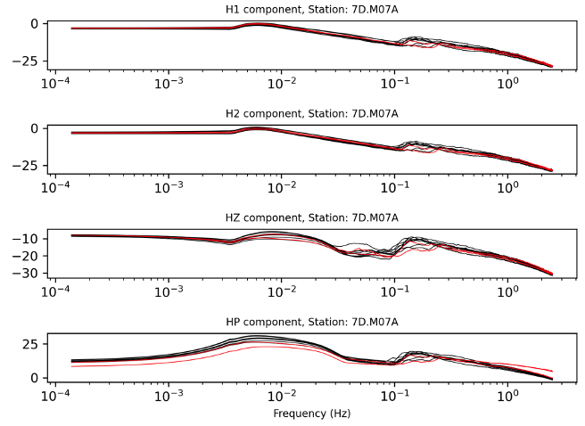
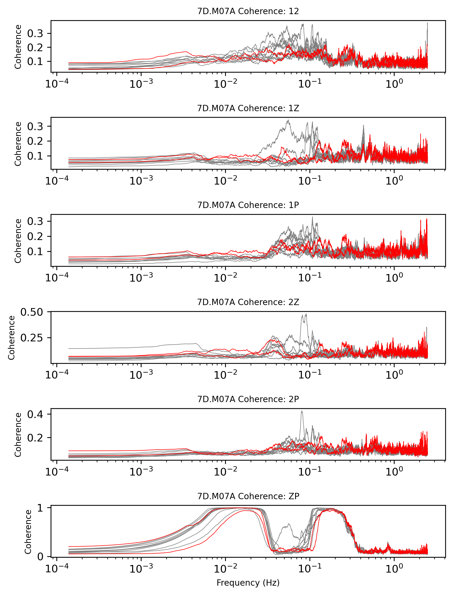
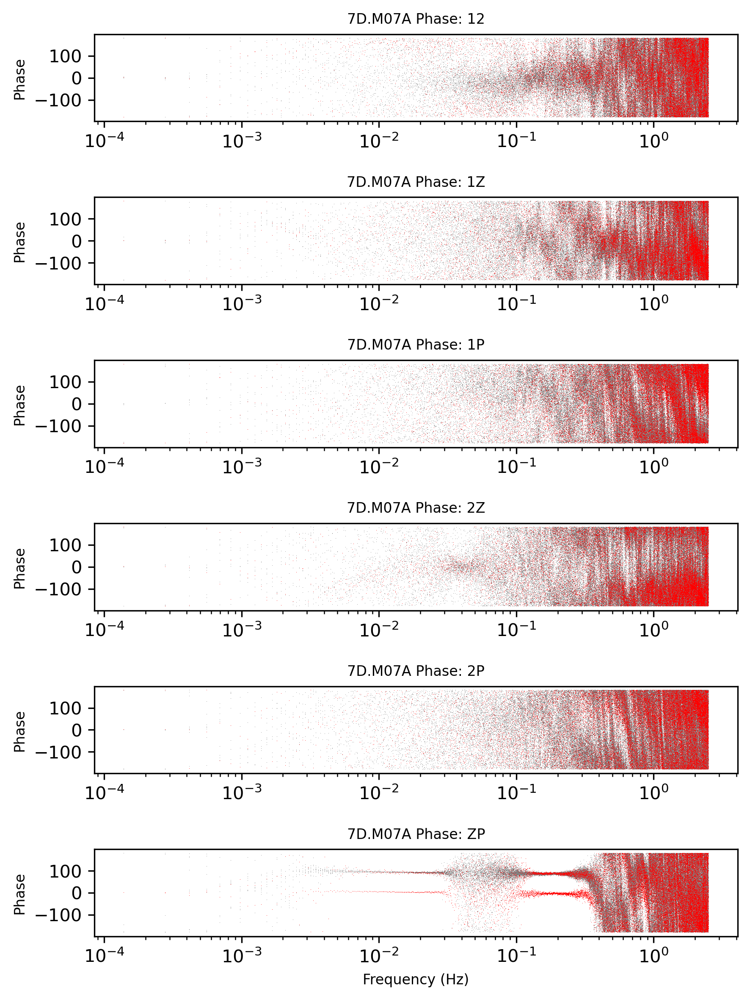
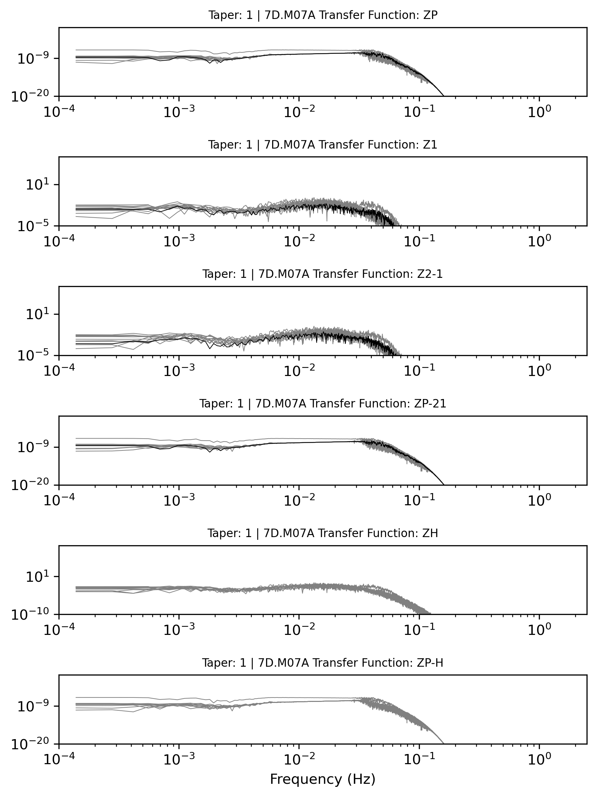
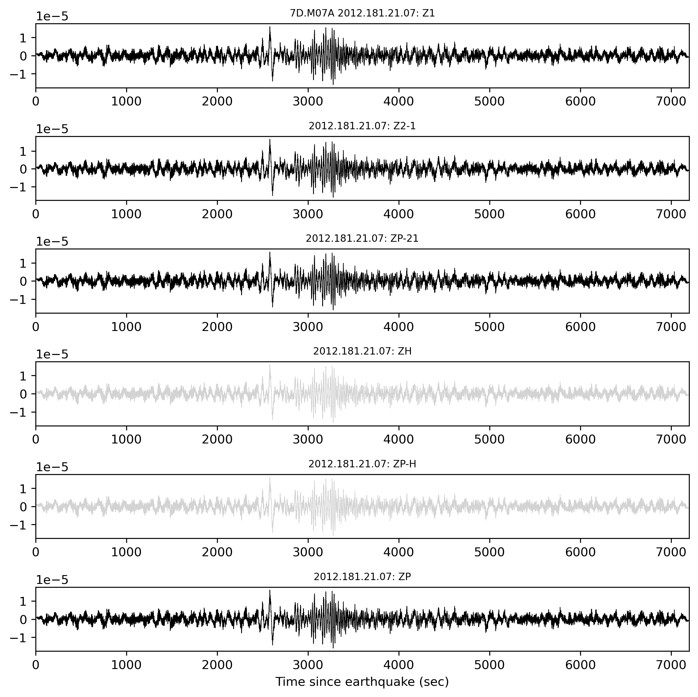

{
 "cells": [
  {
   "cell_type": "markdown",
   "metadata": {},
   "source": [
    "\n",
    "> **This notebook will detail the complete process for exactly how a single station-event is downloaded, corrected by ATaCR, corrected by HPS, and compared with eachother. It can serve as a precise reference (a cookbook) on the specific actions all executed code takes at any stage in the download and corrections to a single station-event and the subsequent comparison of those results.**"
   ]
  },
  {
   "cell_type": "markdown",
   "metadata": {},
   "source": [
    "## Data\n",
    "For this example station-event correction and method comparison, \n",
    "\n",
    "The station will be:\n",
    "* Station:\tM07A\n",
    "* Network:\t7D\n",
    "* Latitude:\t44.898701\n",
    "* Longitude:\t-125.116798\n",
    "* Experiment:\tCASCADIA INITIATIVE\n",
    "* Instrument_Design:\tAB\n",
    "* Seismometer:\tTrillium Compact\n",
    "* Environment:\tNorth Pacific\n",
    "* Pressure_Gauge:\tDPG\n",
    "* Water_Depth_m:\t1356.5\n",
    "\n",
    "The event will be:\n",
    "* Event:\t2012.181.21.07\n",
    "* M:\t6.3\n",
    "* depth:\t17.1\n",
    "* ev_lla:\t43.4335\n",
    "* ev_lon:\t84.6125\n",
    "\n",
    "> Nothing in this correction and comparison process is designed to any specific station or event properties."
   ]
  },
  {
   "cell_type": "markdown",
   "metadata": {},
   "source": [
    "## Procedure Overview\n",
    "\n",
    "This entire process is done, in sequence, in four phases:\n",
    "\n",
    "> Phase One: Download data\n",
    "> \n",
    "> Phase Two: ATaCR Correction\n",
    "> \n",
    "> Phase Three: HPS Correction\n",
    "> \n",
    "> Phase Four: Compare Results "
   ]
  },
  {
   "cell_type": "markdown",
   "metadata": {},
   "source": [
    "## Procedure"
   ]
  },
  {
   "cell_type": "markdown",
   "metadata": {},
   "source": [
    "### `Phase One: Download data`"
   ]
  },
  {
   "cell_type": "markdown",
   "metadata": {},
   "source": [
    "        Step 1.1: Days randomly selected for ATaCR noise download"
   ]
  },
  {
   "cell_type": "markdown",
   "metadata": {},
   "source": [
    "> Using the station's deployment times recorded at IRIS DMC, an external administrator function called [ObsQA.TOOLS.io.DownloadDayNoise](https://github.com/charleshoots/ATACR_HPS_Comp/blob/512a17e70cc906809bddecbc30767b5a219f0a8a/Packages/CompCode/ObsQA/TOOLS/io.py#L858) randomly selects 15 days then calls ATaCR's [atacr_download_data](https://github.com/charleshoots/ATACR_HPS_Comp/blob/512a17e70cc906809bddecbc30767b5a219f0a8a/Packages/ATaCR/OBStools/obstools/scripts/atacr_download_data.py) script to download these days. To ensure the requested noise population is always satisfied and protected from errors caused by data gaps, [atacr_download_data](https://github.com/charleshoots/ATACR_HPS_Comp/blob/512a17e70cc906809bddecbc30767b5a219f0a8a/Packages/ATaCR/OBStools/obstools/scripts/atacr_download_data.py) is called recursively until atleast 15 days of noise from each channel (Z,P,1,2) is downloaded and saved to SAC. If any day fails to download, a new one is randomly selected.\n",
    "\n",
    ">> [Note] 10 days is the minimum target used in the noise spectra calculations. Thus, we download 15 days of noise in case some are removed in the QC steps.\n",
    " \n",
    ">> [Note] the random selection is made with a pre-defined seed so the same selections can be repeated for a given station."
   ]
  },
  {
   "cell_type": "markdown",
   "metadata": {},
   "source": [
    "        Step 1.2: Noise downloaded, pre-processed, then saved to SAC."
   ]
  },
  {
   "cell_type": "markdown",
   "metadata": {},
   "source": [
    "> Within [atacr_download_data](https://github.com/charleshoots/ATACR_HPS_Comp/blob/512a17e70cc906809bddecbc30767b5a219f0a8a/Packages/ATaCR/OBStools/obstools/scripts/atacr_download_data.py), a standard download procedure is implimented for 24-hr four-component seismic/pressure data.\n",
    "\n",
    "> Data is downloaded and processed in this exact sequence:\n",
    "\n",
    "1. 24-hr seismic (Z,1,2) traces are downloaded by the IRIS client.\n",
    "2. In a seperate request to IRIS, 24-hr pressure data is downloaded by the client.\n",
    "3. All channels detrended (linear & demean).\n",
    "4. A 2-corner zero-phase anti-alias filter is applied to each channel at 2.5hz.\n",
    "5. Each channel is resampled to 5hz.\n",
    "6. Timing is checked on all channels to verify perfect overlap. The code is vulnerable to data gaps without this QC step.\n",
    "7. Lastly, instrument response is removed from all four channels then saved to seperate SAC files.\n"
   ]
  },
  {
   "cell_type": "markdown",
   "metadata": {},
   "source": [
    "        Step 1.3: 2-hr Event (used by ATaCR) downloaded, pre-processed, then saved to SAC."
   ]
  },
  {
   "cell_type": "markdown",
   "metadata": {},
   "source": [
    "> Following the exact same set of pre-processing steps but for 2-hr event traces, [atacr_download_event](https://github.com/charleshoots/ATACR_HPS_Comp/blob/512a17e70cc906809bddecbc30767b5a219f0a8a/Packages/ATaCR/OBStools/obstools/scripts/atacr_download_event.py) is called for the chosen event."
   ]
  },
  {
   "cell_type": "markdown",
   "metadata": {},
   "source": [
    "        Step 1.4: 24-hr Event (used by HPS) downloaded, pre-processed, then saved to SAC."
   ]
  },
  {
   "cell_type": "markdown",
   "metadata": {},
   "source": [
    "> To ensure the exact same pre-processing steps used in ATaCR are always applied to the 24-hr event traces used by HPS, the same script used by ATaCR to download 24-hr noise in step 1.2 ([atacr_download_data](https://github.com/charleshoots/ATACR_HPS_Comp/blob/512a17e70cc906809bddecbc30767b5a219f0a8a/Packages/ATaCR/OBStools/obstools/scripts/atacr_download_data.py)) is directed to a 24-hr window that covers the complete day the chosen event occured. The SAC outputs are saved to a separate folder.\n",
    "\n",
    ">> [Note] a reasonable alternative would have been to have ATaCR download its events in 24-hr traces by default and trim them at some later step. However, this would have required changing parts of the download, daily-spectra, and event correction scripts and significantly slowing down ATaCR overall. My approach is simpler and gaurantees identical pre-processing between ATaCR/HPS while still being non-invasive to the ATaCR mechanics and run speed."
   ]
  },
  {
   "cell_type": "markdown",
   "metadata": {},
   "source": [
    "Stages:\n",
    "1. Download data\n",
    "2. ATaCR\n",
    "    1. Download noise\n",
    "    2. Download event\n",
    "    3. Quality-control of noise spectra\n",
    "    4. Average spectra\n",
    "    5. Calculate tilt corrective transfer functions\n",
    "    6. Calculate compliance corrective transfer functions\n",
    "    7. Correct event\n",
    "3. HPS\n",
    "4. Compare results"
   ]
  },
  {
   "cell_type": "markdown",
   "metadata": {},
   "source": [
    "### `Phase Two: ATaCR Correction`\n",
    "\n",
    "Phase Two is implimented in three steps:\n",
    "    2.1: atacr_daily_spectra | Calculation of noise spectra.\n",
    "    2.2: atacr_clean_spectra | Quality control of noise spectra.\n",
    "    2.3: atacr_transfer_functions | Calculate tilt corrective transfer functions"
   ]
  },
  {
   "cell_type": "markdown",
   "metadata": {},
   "source": [
    "        Step 2.1: atacr_daily_spectra | Calculate noise spectra"
   ]
  },
  {
   "cell_type": "markdown",
   "metadata": {},
   "source": [
    "> Using [atacr_daily_spectra](https://github.com/charleshoots/ATACR_HPS_Comp/blob/512a17e70cc906809bddecbc30767b5a219f0a8a/Packages/ATaCR/OBStools/obstools/scripts/atacr_daily_spectra.py), this step yields the daily spectra for each of the 10 days of downloaded noise.\n",
    "\n",
    "> For each day, stft's are made of each of the four channels in 2-hr windows with a 30% overlap. Using the log-PSDs for each, windows with an std-norm greater than 1.5 times the day's std are labeled for removal in the next step (2.2). If less than 10 good windows exist, the day is not used. \n",
    "\n",
    "> A QC figure of all fft segments (good and bad) is saved to show this."
   ]
  },
  {
   "cell_type": "markdown",
   "metadata": {},
   "source": [
    "# Figure: QC of 2-hr STFT segments (7D.M07A.2012.164.QC)\n",
    ""
   ]
  },
  {
   "cell_type": "markdown",
   "metadata": {},
   "source": [
    "# Figure: QC of 2-hr STFT segments (7D.M07A.2012.164.QC)\n",
    ""
   ]
  },
  {
   "cell_type": "markdown",
   "metadata": {},
   "source": [
    "> Using the good windows, the day's average of power and cross channel spectra are calculated and stored.\n",
    "\n",
    "> The day's average of power and cross channel spectra for Z and P are then calculated with respect to the horizontal channels rotated parallel to the direction of maximum coherence with Z. \n",
    "\n",
    "> Lastly, the day's average power spectra (with bad windows removed) is calculated and saved to a figure output.\n",
    "\n",
    ">> [Note] The day's average coherence/phase/admittance are also plotted but are not shown here for the sake of brevity.\n",
    "\n",
    ">> [Note] these ZH and PH spectra and the subsequent related transfer functions are only used in the day-average event corrections. This example will use station averaged transfer functions, so these are never used. Nonetheless, the ATaCR code still calculates and stores everything necessary for either (day or station average) event correction approach."
   ]
  },
  {
   "cell_type": "markdown",
   "metadata": {},
   "source": [
    "# Figure: A single day's average power spectra (7D.M07A.2012.164.average)\n",
    ""
   ]
  },
  {
   "cell_type": "markdown",
   "metadata": {},
   "source": [
    "        2.2: atacr_clean_spectra | Quality control of noise spectra."
   ]
  },
  {
   "cell_type": "markdown",
   "metadata": {},
   "source": [
    "> Using [atacr_clean_spectra](https://github.com/charleshoots/ATACR_HPS_Comp/blob/512a17e70cc906809bddecbc30767b5a219f0a8a/Packages/ATaCR/OBStools/obstools/scripts/atacr_clean_spectra.py), the station's average noise spectra are modeled.\n",
    "\n",
    ">First, all 15 days of day-averaged noise for this station are loaded.\n",
    "\n",
    ">Similar to the QC stage in 2.1, days with component PSDs that have an std>1.5x the station average are labeled for removal. Additionally, an f-test is made againstall day-noise variances to test for an equal distribution of power on the PSDs. Days with less than a 95% confidence interval are also labeled for removal.\n",
    "\n",
    ">With the good days defined, the station-averaged power and cross spectra are calculated and stored. As mentioned with 2.1, HH/HZ/HP are also calculated though never used with station-average corrections.\n",
    "\n",
    ">Lastly, figures are made for station's average admittance, phase, and coherence."
   ]
  },
  {
   "cell_type": "markdown",
   "metadata": {},
   "source": [
    "# Figure: QC of station daily power specta used to make the station average \n",
    "# Red are bad days.\n",
    ""
   ]
  },
  {
   "cell_type": "markdown",
   "metadata": {},
   "source": [
    "# Figure: Station Averaged Coherence\n",
    ""
   ]
  },
  {
   "cell_type": "markdown",
   "metadata": {},
   "source": [
    "# Figure: Station Averaged Admittance\n",
    ""
   ]
  },
  {
   "cell_type": "markdown",
   "metadata": {},
   "source": [
    "# Figure: Station Averaged Phase\n",
    ""
   ]
  },
  {
   "cell_type": "markdown",
   "metadata": {},
   "source": [
    "        2.3: atacr_transfer_functions | Calculate the tilt and compliance corrective transfer functions."
   ]
  },
  {
   "cell_type": "markdown",
   "metadata": {},
   "source": [
    "> Using [atacr_transfer_functions](https://github.com/charleshoots/ATACR_HPS_Comp/blob/512a17e70cc906809bddecbc30767b5a219f0a8a/Packages/ATaCR/OBStools/obstools/scripts/atacr_transfer_functions.py), we build the library of transfer functions used in the tilt and/or compliance correction of the vertical event trace.\n",
    "\n",
    "> In total, there are six primary transfer functions modeled by ATaCR: ZP, Z1, ZH, ZP-H, Z2-1, and ZP-21. The last three are sets of multiple transfer functions. \n",
    "\n",
    "> Before calculating each transfer function, the power and cross spectra are tapered to zero for all frequencies above the station-depth dependent f-notch.\n",
    "\n",
    "> For the station-averaged event correction used in this example, the ZP-21 transfer is used. \n",
    "\n",
    "> ZP-21 is a set of six sub-transfer (denoted by a 'TF_') functions:\n",
    "\n",
    "1. TF_Z1 = c1Z* / c11\n",
    "2. TF_21 = c12* / c11\n",
    "3. TF_P1 = c1P* / c11\n",
    "4. TF_P2-1 = c2P* - (c12*/c11 x c1P)* / c22 x (1-coh12)\n",
    "5. TF_Z2-1 = c2Z* - (c12*/c11 x c1Z)* / c22 x (1-coh12)\n",
    "6. TF_ZP-21 = cZP - (TF_P1 x c1Z)* - (TF_P2-1* x x2Z* - (TF_21 x c12)*) / cPP x (1-coh_1P) x (1-coh_c2cP_c1)\n",
    "\n",
    "> '*' denotes a complex conjugate, 'c' denotes power/cross spectra, 'coh_' denotes a coherence function.\n",
    "\n",
    "> Lastly, the tranfser functions are stored and plotted to figures.\n",
    "\n",
    ">> [Note] Multiple styles of tapering were explored but we ultimately decided to use the same f-notch dependent taper for both compliance and tilt correction transfer functions.  \n",
    "\n",
    ">> [Note] each are calculated at this step for daily and station-averaged spectra with the exception of ZH and ZP-H which are only made for the daily average correction."
   ]
  },
  {
   "cell_type": "markdown",
   "metadata": {},
   "source": [
    "# Figure: All Transfer Functions (daily and averaged)\n",
    ""
   ]
  },
  {
   "cell_type": "markdown",
   "metadata": {},
   "source": [
    "        2.3: atacr_correct_event | Correct the event for tilt and compliance noise."
   ]
  },
  {
   "cell_type": "markdown",
   "metadata": {},
   "source": [
    "> The final step in ATaCR is correcting the event. For this station-averaged correction, we use the ZP-21 transfer function. \n",
    "\n",
    "> After calculating the 4-component event spectra using fft (ftZ, ftP, ft1, and ftP),\n",
    "\n",
    "> The ZP-21 transfer function deconvolves tilt and compliance noise from the vertical event spectra (ftZ) as follow:\n",
    "\n",
    "Corrected = ftZ - TF_Z1*ft1  -  (ft2-ft1*TF_21)*TF_Z2_1  -  (ftP - ft1*TF_P1 -(ft2 - ft1*TF_21)*TF_P2_1)*TF_ZP_21\n",
    "\n",
    "> The corrected spectra is returned to the time-domain, plotted, and saved."
   ]
  },
  {
   "cell_type": "markdown",
   "metadata": {},
   "source": [
    "# Figure: Corrected event traces plot by ATaCR \n",
    "## For the four transfer functions available to a station-averaged spectra.\n",
    ""
   ]
  },
  {
   "cell_type": "markdown",
   "metadata": {},
   "source": [
    "### `Phase Three: HPS Correction`"
   ]
  },
  {
   "cell_type": "markdown",
   "metadata": {},
   "source": [
    "HPS is much simpler to impliment compared to ATaCR.\n",
    "After loading the 24-hr event SAC file for the vertical trace downloaded and pre-processed in, [run_noisecut](https://github.com/charleshoots/ATACR_HPS_Comp/blob/626fe0a8d825bb781f0cef047c1bab857f01f7a2/Packages/CompCode/ObsQA/TOOLS/io.py#L512) pushes the vertical trace to [Noisecut](https://github.com/charleshoots/ATACR_HPS_Comp/blob/512a17e70cc906809bddecbc30767b5a219f0a8a/Packages/NoiseCut/Source/src/noisecut.py).\n",
    "\n",
    "\n",
    "> Noisecut has multiple parameters that can be adjusted.\n",
    "\n",
    "> To remain consistent with Zali et al. (2023), all parameters defined below are hard-set to their published setup.\n",
    "\n",
    "> Within [Noisecut](https://github.com/charleshoots/ATACR_HPS_Comp/blob/512a17e70cc906809bddecbc30767b5a219f0a8a/Packages/NoiseCut/Source/src/noisecut.py), a power spectrogram is calculated using:\n",
    "\n",
    "win_length = 163.84 #seconds for the [raw spectrogram](https://github.com/charleshoots/ATACR_HPS_Comp/blob/626fe0a8d825bb781f0cef047c1bab857f01f7a2/Packages/NoiseCut/Source/src/noisecut.py#L131)\n",
    "\n",
    "hop_length = win_length_sampled // 4  #This corresponds to a 75% overlap.\n",
    "\n",
    "> All subsequent stages in Noisecut run on partitioned (masked) components of the raw spectrogram.\n",
    "\n",
    "> Using only the spectrogram from 0.1 to 1hz, a cosine match-filter is then ran to produce an inverted mask of recurrent noise. Combined with the 0.1-1hz partitioned spectrogram yields a spectrogram in this band containing only the observed recurrent noises sources, [S_background](https://github.com/charleshoots/ATACR_HPS_Comp/blob/626fe0a8d825bb781f0cef047c1bab857f01f7a2/Packages/NoiseCut/Source/src/noisecut.py#L175).\n",
    "\n",
    "> Using only the frequency outside of that same 0.1 to 1hz range, the median filter algorithm (hpss) is then used to produce the spectogram model, [D_harmonic](https://github.com/charleshoots/ATACR_HPS_Comp/blob/626fe0a8d825bb781f0cef047c1bab857f01f7a2/Packages/NoiseCut/Source/src/noisecut.py#L178), containing all observed harmonic noise in this range.\n",
    "\n",
    "> [S_background](https://github.com/charleshoots/ATACR_HPS_Comp/blob/626fe0a8d825bb781f0cef047c1bab857f01f7a2/Packages/NoiseCut/Source/src/noisecut.py#L175) and [D_harmonic](https://github.com/charleshoots/ATACR_HPS_Comp/blob/626fe0a8d825bb781f0cef047c1bab857f01f7a2/Packages/NoiseCut/Source/src/noisecut.py#L178) are then stacked to yield a full band spectogram of ONLY the observed noise.\n",
    "\n",
    "> This noise spectogram is then convolved with its original phase and returned to the time-domain, creating a seismic trace of just the noise. \n",
    "\n",
    "> Finally, this noise trace is subtracted from the raw time-domain trace to yield a noise corrected output."
   ]
  },
  {
   "cell_type": "markdown",
   "metadata": {},
   "source": [
    "### `Phase Four: Compare Results`"
   ]
  },
  {
   "cell_type": "markdown",
   "metadata": {},
   "source": [
    "> My own library of [helper functions](https://github.com/charleshoots/ATACR_HPS_Comp/blob/main/Packages/CompCode/comp_tools.py) and [classes](https://github.com/charleshoots/ATACR_HPS_Comp/blob/main/Packages/CompCode/ObsQA/OBSM/classes.py) are used to make the subsequent analysis much quicker, scalable, and mutable for comparisons of any ATaCR/HPS output.\n",
    "\n",
    " [Comparative_Analysis](https://github.com/charleshoots/ATACR_HPS_Comp/blob/main/Notebooks/Comparative_Analysis.ipynb) has been the primary controller for producing the plots and analysis used in the method comparison.\n",
    "\n",
    " First step in the method comparison for a single station-event is simply to plot the corrected outputs side-by-side.\n",
    "\n",
    " > Note, when loading the comparisons in for this plot, [Comparative_Analysis](https://github.com/charleshoots/ATACR_HPS_Comp/blob/main/Notebooks/Comparative_Analysis.ipynb) sends a copy of the ATaCR vertical trace output to [run_noisecut](https://github.com/charleshoots/ATACR_HPS_Comp/blob/626fe0a8d825bb781f0cef047c1bab857f01f7a2/Packages/CompCode/ObsQA/TOOLS/io.py#L512) to combine the two methods for this third column of traces."
   ]
  },
  {
   "cell_type": "markdown",
   "metadata": {},
   "source": [
    "# Figure: A qualitative comparison of the corrected vertical trace when using either or both of the methods\n",
    "<!--  -->"
   ]
  },
  {
   "cell_type": "markdown",
   "metadata": {},
   "source": [
    "# Figure: Vertical PSD's for each method with the uncorrected trace PSD for reference.\n",
    "<!--  -->"
   ]
  },
  {
   "cell_type": "markdown",
   "metadata": {},
   "source": [
    "> Next, ZZ, ZP, Z1, and Z2 coherences. \n",
    "\n",
    "> ZZ coherence is done between the corrected and uncorrected traces for each method, yielding three coherences in the subplot.\n",
    "\n",
    "> ZP, Z1, and Z2 coherences are done between the corrected traces and the raw P,1,2 channels. The station averaged ZP, Z1, and Z2 noise coherence is plotted in gray.\n"
   ]
  },
  {
   "cell_type": "markdown",
   "metadata": {},
   "source": [
    "."
   ]
  }
 ],
 "metadata": {
  "language_info": {
   "name": "python"
  }
 },
 "nbformat": 4,
 "nbformat_minor": 2
}
